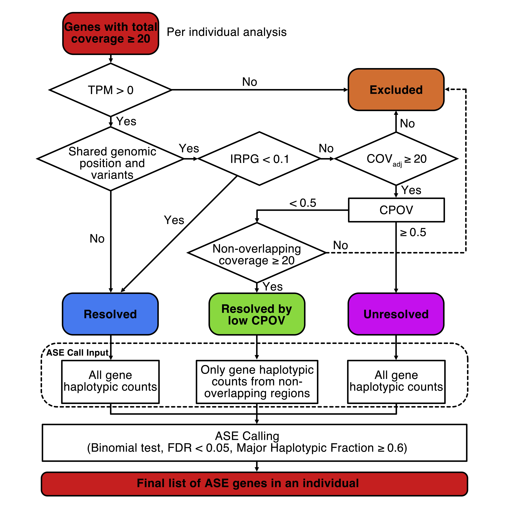

# Overview


Approximately **66% of autosomal genes** in the human genome overlap with other genes (GENCODE v45).  
[In our paper](https://www.biorxiv.org/content/10.64898/2025.12.03.692205v1), we observed that among **COV20 genes** (coverage ≥ 20), **48%** shared overlapping regions and **32%** shared overlapping heterozygous variants with at least one other gene.  

In the **phASER algorithm** and ASE pipelines in general, RNA reads aligning to heterozygous variants in overlapping regions are assigned to all genes at that locus. This obligatory misattribution distorts ASE quantification by either:  
- falsely mirroring ASE of one gene to overlapping genes, or  
- concealing true ASE if multiple genes contribute reads to the same locus.  

To overcome this limitation, we developed **TOGA (Transcript reassignment for Overlapping Genes in ASE)**. TOGA reassigns reads overlapping multiple genes to their most likely gene of origin by integrating:  
- paired normalized RNA-seq expression data, and  
- **GENCODE v45** exon/intron annotations.

---

# Workflow
  

---

# Example Figure


---

# Dependencies
- **phASER** and **phASER geneAE** → [phASER GitHub](https://github.com/secastel/phaser)  
- **Python 3.x** → `pandas`, `numpy`, `scipy`, `statsmodels`
- **bedtools**      
- **R ≥ 3.3** → `tidyverse`  
  *(only required if running `extract_var_hap_cnt.R` — see Usage below)*

---

# Terminology
- **COV Genes**: Genes with sufficient reads (≥ coverage threshold).  
- **CPOV** (Contribution Proportion of Overlapping Variants): Proportion of reads an overlapping variant contributes to a given gene.  
- **IRPG** (Incorrectly-assigned Read Proportion per Gene): Likelihood of incorrect read assignment in overlapping genes.
  `(1 - CPOV) × (overlapping read count) / (overlapping + non-overlapping read count)`
- **COV<sub>adj</sub>** (Adjusted Coverage): The adjusted haplotypic total count computed by redistributing reads from overlapping variants using CPOV and summing the non-overlapping variant counts. 
  `(CPOV × overlapping counts) + non-overlapping counts`
- **MHF** (Major Haplotypic Fraction): The proportion of reads coming from the dominant haplotype
  `max(hapA_count / total_hap_count, hapB_count / total_hap_count)`

---

# Input Files

### Required
- `{sample}.bam`: BAM file from `1_rnaseq`
- `{sample}.vcf`: VCF file from `2_phaser`
- Normalized gene expression file matching `{sample}` from `3_rsem`
  - We used **RSEM** to generate this expression file. The code can be found [here](../RNA-quantification/rsem_rna_quantification.sh). The format matches the standard RSEM output.  
  - eg. `all_samples.tpm.tsv`

### Optional (provided in `/resource`, built from GENCODE v45)
- Gene coordinates + type + symbol: `gencode.v.45.gene_coordinates.type.gene_symbol.bed`  
- Gene coordinates: `gencode.v.45.gene_coordinates.bed`  
- Exon coordinates: `gencode.v45.exon.basic.partitioned.bed`  
- Variant blacklist: `gencode45_hg38_hla.chr.bed`  
- Haplocount blacklist: [hg38_haplo_count_blacklist.chr.bed.gz](https://www.dropbox.com/s/9cn9477bcutvuc7/hg38_haplo_count_blacklist.chr.bed.gz)

---

# Usage
## Step 1. Get COV Genes and Identify Overlapping Genes
```
python3 a_create_overlapping_info.py
    -s sample_id \
    -i /path to/phaser geneAE file \
    -o /path to/output directory \
    -e /path to/normalized gene expression file \
    -g /path to/gene coordinate file with gene type and gene symbol \ # Optional. Default as `../resource/gencode.v.45.gene_coordinates.type.gene_symbol.bed`
    -c coverage threshold # Optional. Default as 20
```
### Outputs
Written in the directory: `../data/output/toga/${SAMPLE}`
#### 1.`{sample_id}.cov.overlapping_info.txt`

List of COV genes from phASER geneAE with overlapping information and normalized RNA expression added.

Columns include:
  - **type**: Gene type (e.g. protein-coding, lncRNA...)
  - **gene_symbol**: Gene symbol
  - **overlapped_flags**: Whether the gene overlaps with another COV gene (`True` or `False`)
  - **overlapped_gene_name**: Names of overlapping genes (comma-separated if multiple)
  - **overlapped_gene_symbol**: Gene symbols of overlapping genes (comma-separated if multiple)
  - **overlapped_gene_type**: Gene types of overlapping genes (comma-separated if multiple)
  - **overlapped_length**: Length of the overlapping genomic regions (comma-separated if multiple)
  - **overlapped_region**: Overlapping region(s) in the format (`start`, `end`) (comma-separated if multiple)
  - **norm_rna_exp**: Normalized RNA expression of the gene. 

#### 2.`{sample_id}.cov.overlapping_region.bed`

BED file containing overlapping genomic intervals. This file is used to filter out reads aligned to shared variants between overlapping genes.

##### On 1KG:
```
python3 a_create_overlapping_info.py -s HG00513 -i ../data/output/phaser/HG00513/phaser_run/HG00513.gene_ae.txt -o ../data/output/toga/ -e ../data/output/rsem/all_samples.tpm.tsv -g ../resource/gencode.v.45.gene_coordinates.type.gene_symbol.bed -c 20
```
## Step 2. Generate Gene-Level Haplotypic Counts Without Shared Variants

`b_phaser_nonoverlap.sh` runs **`phASER geneAE`** output using only reads aligned to **non-overlapping variants** for each gene. These results will be used in the TOGA algorithm.

We merge phASER's haplocount blacklist with the overlapping genomic intervals, then
run phASER. Run:

```
./b_phaser_nonoverlap.sh
```

phASER is run with:
1. a new output directory (--o)
2. the merged haplocount blacklist (--haplo_count_blacklist)

## Step 3 (Optional): Add Allelic Counts per Haplotype
`c_extract_var_hap_cnt.R` appends haplotype-specific allelic counts to the **phASER geneAE** outputs. It generates a subset of the geneAE file with four additional columns.

* **varHapA**: Alleles in haplotype A 
* **varHapB**: Alleles in haplotype B
* **varCntA**: Allelic counts in haplotype A
* **varCntB**: Allelic counts in haplotype B

```
# Add allelic counts to phASER geneAE data
Rscript extract_var_hap_cnt.R \
  -i /path/to/directory_with_phaser_outputs \
  -h /path/to/haplotypic_counts.txt \
  -a /path/to/allelic_counts.txt \
  -g /path/to/gene_ae.txt \
  -o /path/to/output_directory

# Add allelic counts to phASER geneAE data (without shared variants)
Rscript extract_var_hap_cnt.R \
  -i /path/to/directory_with_blacklist_applied \
  -h /path/to/haplotypic_counts.txt \
  -a /path/to/allelic_counts.txt \
  -g /path/to/gene_ae.txt \
  -o /path/to/output_directory
```
##### On 1KG:
Ran the following for all samples:
```
[user]$ SAMPLE=HG00513
[user]$ Rscript c_extract_var_hap_cnt.R -i ../data/output/toga/phaser_nonoverlap/${SAMPLE} -h ${SAMPLE}.haplotypic_counts.txt -a ${SAMPLE}.allelic_counts.txt -g ${SAMPLE}.gene_ae.txt -o ../data/output/toga/${SAMPLE}/var_hap_cnt.nonoverlap.txt
[user]$ Rscript c_extract_var_hap_cnt.R -i ../data/output/phaser/${SAMPLE}/phaser_run -h ${SAMPLE}.haplotypic_counts.txt -a ${SAMPLE}.allelic_counts.txt -g ${SAMPLE}.gene_ae.txt -o ../data/output/toga/${SAMPLE}/var_hap_cnt.txt
```

## Step 4: TOGA Time!

Run TOGA with the following command:

```
python3 TOGA.py \
    -s $SAMPLE_ID \
    -a $INPUT_ALLELIC_LEVEL \
    -i $INPUT_COV_OVERLAPPING_INFO \
    -p $INPUT_GENE_LEVEL_WO_OVERLAPPING \
    -o $OUTDIR
```

### Arguments
Required
* **-s**: sample_id
* **-a**: phASER allelic count file (`*.allelic_counts.txt`, output from Step 1)
* **-i**: COV genes (phASER geneAE with overlapping info, `*.cov.overlapping_info.txt`, output from Step 2)
* **-p**: phASER geneAE output without shared variants (`/path to phaser output without shared variants/*.gene_ae.txt`, output from Step 3)
* **-o**: Output directory

Optional
* **-e (../resource/gencode.v45.exon.basic.partitioned.bed)**: Exon coordinate BED file
* **-c (20)**: Coverage cutoff for non-overlapping variants used for determining `Resolved by CPOV`. 
* **-ex (0)**: Normalized RNA expression cutoff. Genes with expression values ≤ cutoff are tagged as `Excluded`
* **-we (0.99)**: Weight for exonic variants
* **-wi (0.01)**: Weight for intronic variants
* **-cp (0.5)**: CPOV cutoff. Genes with CPOV ≥ cutoff are tagged as `Unresolved`
* **-ir (0.1)**: IRPG cutoff. Genes with IRPG < cutoff are tagged as `Resolved`
* **-ac (20)**: COV<sub>adj</sub> cutoff. Genes with COV<sub>adj</sub> < cutoff are tagged as `Excluded`
* **-r (1.5)**: MHF cutoff for ASE calling. Genes with MHF ≥ cutoff are considered as ASE genes
* **-f (0.05)**: Binomial FDR cutoff for ASE calling. Genes with FDR < cutoff are considered as ASE genes
* **-w (1)**: Write the extended TOGA result file with detailed outputs (0 or 1)
* **-v ()**: A file with allelic counts for each haplotype from phASER geneAE output
* **-vw ()**: A file with allelic counts for each haplotype from phASER geneAE output without shared variants

> **Note**: Providing inputs to `-v` and `-vw` will add haplotype-specific allelic counts to TOGA outputs.
> We provide a helper script to generate these input files. See the `Optional Step` below for details.  

On 1KG:
```
[user]$ SAMPLE=HG00513
[user]$ python3 d_TOGA.py -s ${SAMPLE} -i ../data/output/toga/${SAMPLE}/${SAMPLE}.cov.overlapping_info.txt -a ../data/output/phaser/${SAMPLE}/phaser_run/${SAMPLE}.allelic_counts.txt -p ../data/output/toga/phaser_nonoverlap/${SAMPLE}/${SAMPLE}.gene_ae.txt -o ../data/output/toga/${SAMPLE} -e ../resource/gencode.v45.exon.basic.partitioned.bed -v ../data/output/toga/${SAMPLE}/var_hap_cnt.txt -vw ../data/output/toga/${SAMPLE}/var_hap_cnt.nonoverlap.txt
```

---

# Outptut

`d_TOGA.py` provides per-sample results, a file for each sample that contains ASE data for genes within that samples (eg. read counts, allelic imbalance, overlapping genes, etc.)

#### 1.`*_TOGA_light.txt`

The main TOGA output with the following columns:

* **contig**: Chromosome
* **start**: Start position of genomic region (0-based)
* **stop**: End position of genomic region (0-based)
* **name**: Gene name
* **gene_symbol**: Gene symbol
* **type**: Gene: Gene type (e.g. protein-coding, lncRNA…)
* **hapA_count**: Read counts on haplotype A
* **hapB_count**: Read counts on haplotype B
* **total_hap_count**: Total haplotypic counts(hapA_count + hapB_count)
* **log2_aFC**: Haplotypic fold change (hapA_count / hapB_count, log2-scaled)
* **MHF**: Major Haplotypic Fraction
* **n_variants**: Number of heterozygous variants used in the gene
* **variants**: Heterozygous variants used in the gene (chr_pos_ref_alt)
* **binom_p**: p value from binomial test using hapA and hapB counts
* **binom_fdr**: FDR-adjusted p-value from the binomial test
* **overlapped_flags**: True if the gene overlaps with other COV genes
* **overlapped_gene_name**:	Name of overlapping genes
* **overlapped_gene_symbol**: Gene symbol of overlapping genes
* **overlapped_gene_type**:	Types of overlapping genes
* **overlapped_length**: Length of the overlapping region
* **overlapped_region**: Genomic coordinates of the overlapping region
* **variants_overlapping**:	Variants overlapping with other genes
* **gene_group_by_variants**: Genes grouped if the variants are mutally shared
* **gene_group_by_regions**: Genes grouped if the regions are mutally shared
* **norm_rna_exp**: Normalizd RNA expression for the gene
* **CPOV**: Contribution Proportion of Overlapping Variants
* **IRPG**: Incorrectly-assigned Read Proportion in Overlapping Genes
* **adj_total_hap_count**: COV<sub>adj</sub>. Adjusted haplotypic counts.
* **TAG**: Gene status — Resolved (R), Resolved by CPOV (RC), Excluded (E), or Unresolved (U). Genes without tag `E` are used for ASE calling.
* **ASE_COV**: Classification as COV or ASE gene

When inputs for `-v` and `-vw` are provided, the following columns are added:  
* **hapA_allele**: Alleles on haplotype A
* **hapB_allele**: Alleles on haplotype B
* **hapA_allele_count**: Allelic counts on haplotype A
* **hapB_allele_count**: Allelic counts on haplotype B

#### 2.`*_TOGA_heavy.txt`
An extended TOGA output with additional columns.  
Generated only when `-w 1` is specified.  

The dictionary file of columns can be found [here](../resource/heavy_dict.tsv).

---

# Useful Step: Generate Per-Sample, Per-Gene Statistics
We provide a convenient post hoc utility script that computes per-sample and per-gene summary statistics from ASE results. 

`d_TOGA.py` generates per-sample results on TOGA-corrected ASE calls, while `e_stat_TOGA.R` provides per-gene results. This script takes as input a directory containing TOGA output subdirectories, each with a `*_TOGA_light.txt` file and produces summary statistics.

Alternatively, the scripts in `ase_call` provide the same data without running TOGA. See [`ase_call`](https://github.com/JS2871/ASE/tree/main/ase_call) for more information on the outputs of the `4_toga` and `ase_call` scripts.

### Arguments
#### Required
* -i, --input: Input directory containing sample subdirectories. Each must include `*_TOGA_light.txt` results.
* -o, --output: Output directory where results will be written. WARNING: If this directory exists, it will be deleted and overwritten.

On 1KG:
```
Rscript e_stat_TOGA.R \
  -i ../data/output/toga/ \
  -o ../data/output/toga/stats/
```
---

# References

ASE paper: [Onuchic-Whitford et al. 2026](https://www.biorxiv.org/content/10.64898/2025.12.03.692205v1)

phASER: [E. Castel et al., Nature Communications, 2016](https://www.nature.com/articles/ncomms12817)

RSEM: [Bo Li & Colin N Dewey, BMC Bioinformatics, 2011](https://bmcbioinformatics.biomedcentral.com/articles/10.1186/1471-2105-12-323)

---

# Useful Files

[Gencode v45](https://www.gencodegenes.org/human/release_45.html)

[Known haplotypic count & variant blacklist](https://github.com/secastel/phaser/tree/master/phaser)
