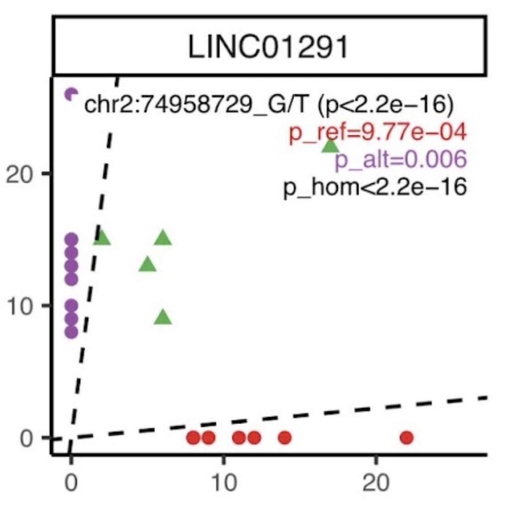
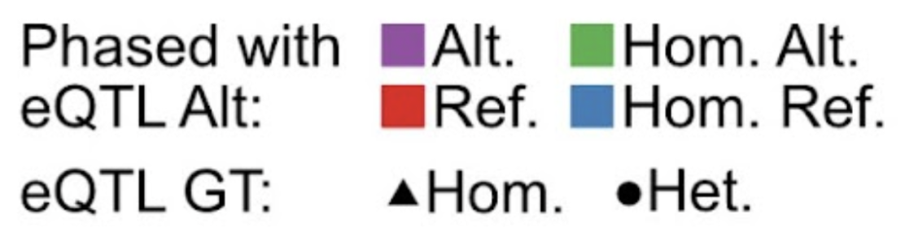

# Identify Imprinting Genes

This folder uses population-level ASE data to determine genes that are candidates for genomic imprinting in the dataset. While further wet-lab analysis would be necessary to confirm their imprinting status, the genes in the final list have expression patterns consistent with impritning.

## Generate Baran et al. Imprinting Pipeline Input Files

`a_prepare_imprinting.R` creates the files necessary to run the Baran et al pipeline. The pipeline can be found [here](https://github.com/zaitlenLab/RNA_Imprinting). The below scripts assume Baran's `RNA_Imprinting` repository was cloned into the same directory as our `ASE` repository.

The outputs of `a_prepare_imprinting.R` are further placed into the subdirectories they should go in `RNA_Imprinting`. For example, files in `../data/output/imprinting/aux_files/` should be moved to `RNA_Imprinting/aux_files/`. The lines to run after a successful `a_prepare_imprinting.R` run are: 

```
mv -f ../data/output/imprinting/aux_files/* ../../RNA_Imprinting/aux_files/
mv -f ../data/output/imprinting/data/* ../../RNA_Imprinting/data/
mkdir ../../RNA_Imprinting/results
```

## Run Baran et al pipeline

`b_filter_model.m` is an edited version of `RNA_Imprinting/analysis/filter_model.m` that points to the new input files created in `a_prepare_imprinting.R`. Move `b_filter_model.m` into `RNA_Imprinting/analysis/` and run the script in a MATLAB window.

Command Line: 
```
cp b_filter_model.m ../../RNA_Imprinting/analysis/
```

MATLAB:
```
>> b_filter_model
```

## Identify Final Imprinting Candidates

As an expansion to Baran et al's pipeline, we also test the influence of strong eQTLs that may better explain the gene's expression than ASE. The full details of this can be found in the Supplementary Materials: `Identification of imprinting genes`. 

As a brief example, gene `LINC01291` (below) in our GLOM data was labelled as Imprinted when Baran et al's pipeline was run on our data, and generally had the L-shape expected of imprinting. However, when coding SNPs were colored by their phasing to `chr2:74958729_G/T`, a significant eQTL for this gene.




We see that the red coding SNPs, who's reference allele was phased with the Alt eQTL (Alt increases expression) had monoallelic reference expression. Similarly if the alternative coding SNP was phased with the Alt (purple), then there was alternative monoallelic expression. Finally those homozygous for the eQTL (triangles) had balanced expression. All three of these characteristics are tested for by our 3 binomial tests, and all were significant for an eQTL explanation, rather than imprinting.

`c_identify_imprinted.R` runs this test for all genes identified as candidate imprinted by Baran et al, outputting a final list without eGenes and creating the above, colored L-plot for all eQTL-gene pairs tested.

### Inputs  
- `../../RNA_Imprinting/results/1KG.txt.impglr.res.txt`:  
  Baran Imprinting likelihood results, created by step (b).  
- `../data/output/imprinting/all_samples.allelic_counts.cov8.tsv`:  
  Allelic count table, created by step (a).  
- `/.../eQTLs.txt`:  
  Per-variant eQTL data. The toy file includes columns: `SNP`, `beta`, `gene`, `t-stat`, `p-value`, `FDR`.  
- `../resource/subject_ids.tsv`:  
  List of sample IDs with corresponding VCF data.  

### Outputs  
- `../data/output/imprinting/1KG.baran_imprinted.tsv`:  
  Initial list of imprinting candidate genes before eGene removal.  
- `../data/output/imprinting/figures/{gene}/{gene}.{eQTL}.l_plot.pdf`:  
  Diagnostic plots showing eQTL effects for each gene.  
- `../data/output/imprinting/1KG.final_imprinted.tsv`:  
  Final list of putatively imprinted gene candidates after removing eGenes.